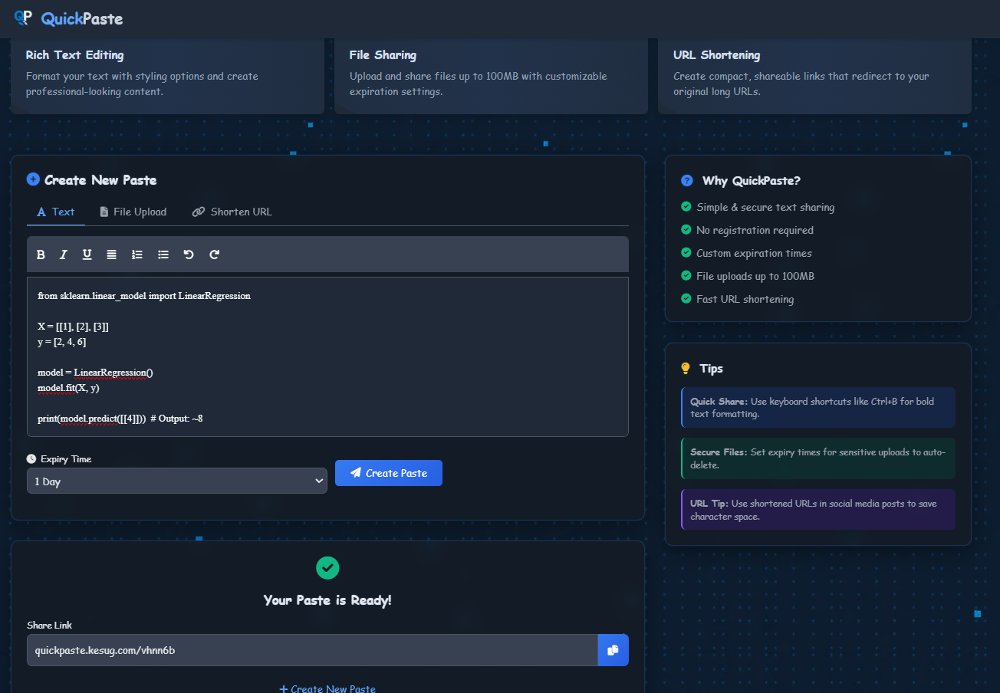
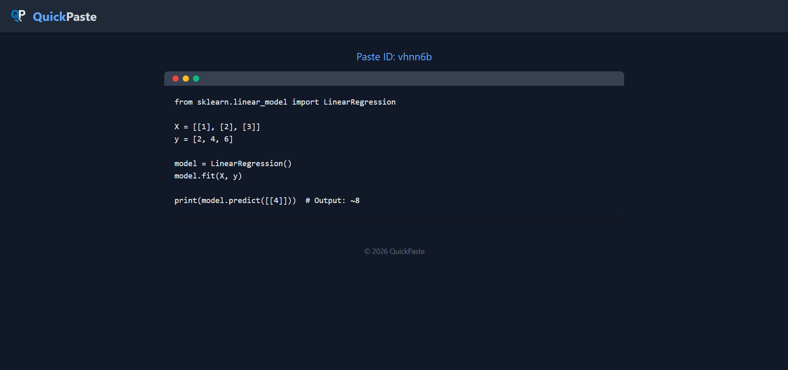
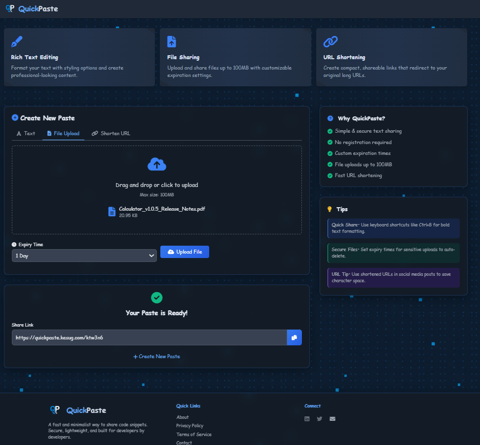
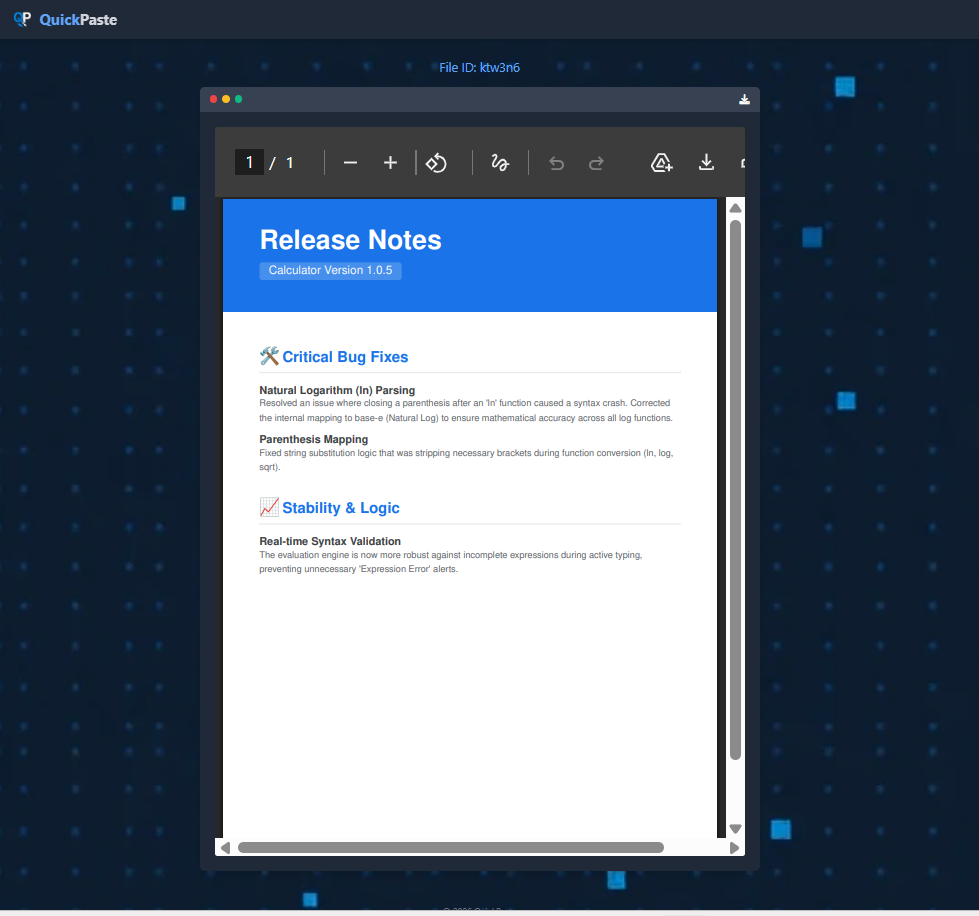
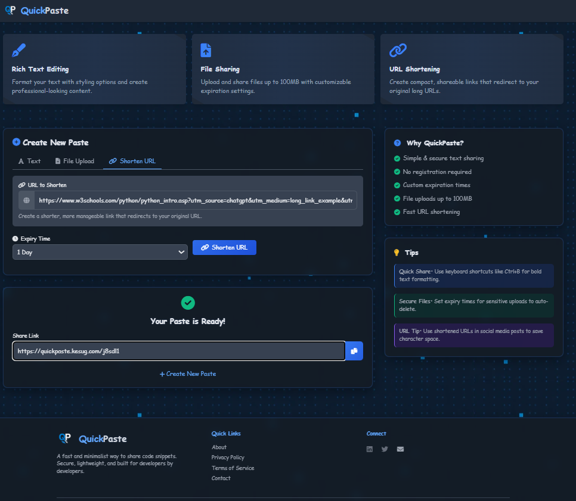

# 📘 QuickPaste
**Fast. Minimal. Secure.** *Instantly share text, files, and links — zero friction, maximum speed.*

 [](https://quickpaste.kesug.com/)
 [](https://www.php.net/)
 [](https://tailwindcss.com/)

---
## 🚀 Overview

**QuickPaste** is a lightweight utility designed for developers and power users who need to move data across devices without the bloat of accounts or databases.

### 🧩 Core Features
- **✍️ Smart Text Sharing:** Rich text support with instant unique links.
- **📂 File Hosting:** Support for uploads up to **100MB** with built-in previews.
- **🔗 URL Shortener:** Clean routing and instant redirection.
- **🎯 Performance:** No database required; uses a high-speed file-based system.

---

## 📁 Folder Structure

```bash
QuickPaste/
├── core/                
│   ├── database.php     <-- Database connection & Table creation
│   └── seo.php          <-- SEO Logic (Already provided)
├── public/              
│   ├── assets/ (js, css, images)
│   ├── includes/ (header.php, footer.php)
│   ├── index.php        <-- Your main UI
│   ├── view.php         <-- NEW: One file to display ALL pastes/files
│   └── s.php            <-- NEW: Handles all short URLs
├── DB/                  <-- Secure folder for SQLite and Uploads
│   ├── uploads/         <-- Physical files (images/pdfs)
│   └── quickpaste.db    <-- The Database file
└── .htaccess            <-- NEW: Makes URLs pretty (quickpaste.com/xyz)
```
---
## 🖼️ Preview

| 📝 Text | 📁 File | 🔗 S-URL |
| :---: | :---: | :---: |
| **Input**<br><br>**Output**<br> | **Input**<br><br><br>**Output**<br> | **Input**<br><br><br><br>**Output**<br> <small> [Load the url and redirect to the original link[ </small> |
---

## ⚙️ Requirements
- PHP 7.0+
- Apache Server (XAMPP / CPanel)
- `.htaccess` support enabled


---

## 🚀 Setup Instructions

1. **Upload all files** to your hosting root directory.
2. Ensure the following folders are **writable** (set permissions to `0777` if necessary):

   ```bash
   /pastes/
   /uploads/
   php/shorten_url.php
   ```
3. Update the base URL in the following PHP files:

   ```php
   // Example in save_paste.php
   $baseUrl = 'https://niggapaste.kesug.com';
   ```
4. Launch `index.php` in your browser and test the app.

---

## 🔒 Security Notes

* ✅ All inputs are sanitized to prevent **XSS** attacks
* 🔐 Unique paste IDs are generated using PHP's `random_bytes()` for enhanced security

---

## 🔗 Example Links

* 📄 Paste: https://quickpaste.kesug.com/abc123
* 📁 File: https://quickpaste.kesug.com/file123.png
* 🔗 Short URL: https://quickpaste.kesug.com/xyz789

---

## 📜 License & Usage

> This project is **public for viewing only**.
>
> * ❌ Do not rehost, redistribute, or use this project commercially without explicit permission.
> * ✅ Allowed for personal and educational exploration.
> * 🔒 Only authorized contributors may modify the codebase.

---

Built  for the **@CodedByManish**
